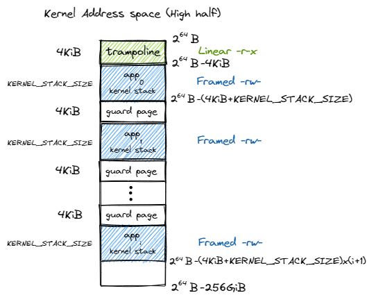
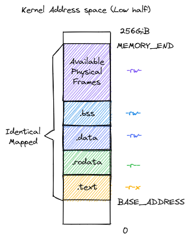
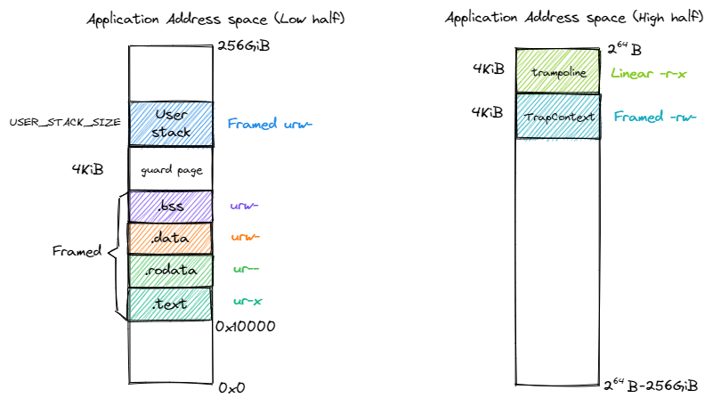

# Lab2 

## 编程作业

1. `sys_get_time` 实现思路
    + 实现 `sys_get_time`, 需考虑 `TimeVal` 跨页的问题, 其可参考 `sys_write` 中 `translated_byte_buffer` 的使用.
    + 在使用 `translated_byte_buffer` 时, 应熟悉其语义, 即 **将一个用户空间中连续的虚拟内存地址缓冲区, 转换为内核可以直接访问的一个或多个物理内存切片**. 
    + 首先获取当前时间 tv, 将 tv 转为字节数组 src, 将应用地址空间中的一段缓冲区 _ts 转化为在内核地址空间直接读写的字节切片向量 bufs, 将 src 分批次复制到 bufs 中.
2. `sys_trace` 实现思路
    + 实现 `sys_trace`, 最重要的是检查地址的权限. 对于用户态的应用, 应该检查相应 `PTE` 的 `U` 位是否为 `1`, 若为 0 则不应允许用户访问. 实现初期, 由于未考虑 `PTE_U`, 运行 `ch4_trace1.rs` 导致操作系统崩溃, 其他应用无运行的机会.
    + 实现 `sys_trace` 的统计系统调用功能, 可考虑在应用的 `TaskControlBlock` 这加入类型为 `BTreeMap<usize, usize>` 的 `syscall_counter`, 无需使用数组进行统计.
3. `sys_mmap` 实现思路
    + 实现 `sys_mmap` 时, 应先检查 start 地址是否页对齐, 还需要检查权限设置是否合法.
    + 在 `MemorySet` 中设置辅助函数 `map_pages`, 其接受虚拟起始地址 `sva` 和虚拟结束地址 `eva` 以及权限 `perm`, 实际创建相应的映射关系.
    + 在 `map_pages` 这, 首先检查 `[sva.floor, eva.ceil)` 中是否存在已经被映射的页, 即检查此与 `areas` 中任意 `vpn_range` 是否存在交叠. 检查交叠的函数 `SimpleRange<T>.overlap` 较为容易实现: `!(self.r <= other.l || other.r <= self.l)`.
    + 通过交叠检查后, 直接调用 `MemorySet.push` 即可.
    + 本次并未检查物理内存是否足够, 但也通过测试, 后面有时间再加入.
4. `sys_munmap` 实现思路
    + 参考相关测试用例发现, `sys_munmap` 回收的区域与之前调用 `sys_mmap` 的申请的区域一致, 或者之前未通过 `sys_mmap` 申请区域, 由此可直接按照比较 `[sva.floor, eva.ceil)` 与 `areas` 中 `vpn_range` 是否相等, 若存在相等的项, 则释放成功.
    + 此实现较为简单, 后续考虑更复杂的场景.

## 简答作业
1. sv39 页表项的组成, 以及其标志位的作用.
    + 
    + sv39 页表项 PTE 由 PPN 和各标志位组成.
        + V: 页表项是否有效
        + R: 页是否具有读取权限
        + W: 页是否具有写入权限
        + X: 页是否具有执行权限
        + U: 页是否在 U Mode 可被访问
        + A: 从页表项上的这一位被清零之后, 页表项的对应虚拟页面是否被访问过
        + D: 从页表项上的这一位被清零之后, 页表项的对应虚拟页面是否被修改过
2. 缺页
    + 哪些异常可能是缺页导致的？
        + Instruction Page Fault: 当 CPU 的取指单元尝试从一个虚拟地址获取下一条指令, 但该地址的页表项无效或不存在时发生;
        + Load Page Fault: 当执行 load 指令尝试从内存读取数据, 但目标虚拟地址的页表项无效或不存在时发生;
        + Store Page Fault: 当执行 store 指令尝试向内存写入数据, 但目标虚拟地址的页表项无效或不存在时发生; 
    + 发生缺页时的重要寄存器
        + `scause` 指明异常的原因
        + `stval` 保存导致异常的虚拟地址
    + Lazy 策略的好处
        + 提高内存利用率
        + 减少不必要的 I/O 操作
    + 申请 10G 连续的内存页面, sv39 页表占用多少内存?
        + 一个页 4 KB, 一个 PTE 8 Byte, 则一个页可存放 512 个 PTE.
        + 映射 10GB 连续的内存页需要的页数: 10GB / 4KB = 2.5 * 2^20 个页面, 其需要占用三级页表 2.5 * 2^20 * 8 Byte = 20 * 2^20 Byte = 20 MB
        + 每个二级页表可指向 512 个三级页表, 则需要二级页表项数目为: 2.5 * 2^20 / 512 = 5120, 二级页表占用的存储空间为 5120 * 8 Byte = 40 KB
        + 一级页表项的数目为: 5120 / 512 = 10, 即只需要一个一级页表 4KB
        + 故为映射 10G 的内存, 页表本身就需要占用大约 20MB 的物理内存. 
    + 如果采用 Lazy 策略, 可减少页表占用物理内存.
      + 当用户调用 mmap 申请 10G 内存时, 操作系统并不会立即分配物理页帧和建立完整的页表映射. 
      + 在进程的 MemorySet 中, 记录下这个虚拟地址区间 [start, start + 10G) 是合法的, 并记下其权限.
      + 当进程第一次访问这 10G 区域内的某个地址时, 会触发存储缺页或加载缺页异常.
    + Swap
      + 若页面被换出到磁盘, 页表项的有效位会被清除, 可以使用 PPN 和 Reversed 保存额外信息.
3. 双页表与单页表
    + 在单页表模型中, 更换页表只发生在进程上下文切换的时候.
    + 在 RISC-V 的页表项 PTE 中, 存在 U (User) 位, 当 U 位 = 0 时表示这个页面是内核页.
    + 开销小: 当用户进程通过系统调用或因中断进入内核时不需要更换页表.
    + 双页表: **用户态/内核态切换**和**进程上下文切换**时需要更换页表

## 代码解读

- `PageTable`
    - `PageTable` 结构
        - 三级页表的层次结构为: 根页表 → 二级页表 → 三级页表 → 物理页帧
        - `root_ppn` 保存根页表所在的物理页号. 在分页模式下启用此 `PageTable`, 需将 `stap` 寄存器设置为根页表的物理地址.
        - `frames` 是存放若干 `FrameTracker` 的 `Vec`, 其用于管理页表自身占用的所有物理页号. 
            - 当新建(`new`) `PageTable` 时, 需为根页表分配物理页帧, 并将此物理页号存于 `frames`.
            - 根据 vpn 查找 pte (`find_pte_create`) 时, 此过程会经过多个 pte, 若其中某个 pte 无效, 则表示此 pte 对应的物理页不存在, 此时应该为其分配物理页帧, 并放于 `frames`. 但是, 最后一级 pte 指向的是用于存放数据或代码的物理页(非存放页表的物理页), 其物理页号不必存于 `frames`. 即 `PageTable` 的 `frames` 只会存放用于保存页表项 pte 的物理页号.
            - 当 `PageTable` 示例被销毁时, 其 `frames` 中保存的 `FrameTracker` 也会被销毁, 从而自动释放其关联的物理页帧(当 `FrameTracker` 被销毁时, 会自动调用 `frame_dealloc` 对关联的物理页帧进行销毁). 
    - `PageTable` 方法
        - `find_pte_create` 、`find_pte` 为内部方法, 外部不可直接调用, 其被 `map` 和 `unmap` 调用. 
        - `find_pte_create` 在执行过程中会自动分配用于存放 pte 的物理页帧, 并存于 `frames`. 
        - `map` 函数用于关联 vpn 和 ppn, 其会根据 vpn 调用 `find_pte_create` 来获取 pte, 然后将 ppn 以及 flags 存入 pte. `map` 函数只做 vpn 和 ppn 的映射, 不在乎其用途. 映射的物理页应交由上层调用者管理.

- `MapArea`
    - `MapArea` 结构
        - `MapArea` 用于管理一段**连续虚拟内存**, 即代表逻辑段. 在一个进程的地址空间(MemorySet)中, 不同的逻辑段(如代码段、数据段、用户栈等)都会用若干 `MapArea` 表示.
        - `VPNRange` 描述一段虚拟页号的连续区间, 表示该逻辑段在地址区间中的位置和长度.
        - `MapType` 描述该逻辑段内的所有虚拟页面映射到物理页帧的方式
            - `MapType::Identical` 恒等映射, 虚拟地址等于物理地址. 主要用于内核空间.
            - `MapType::Framed`：帧式映射, 虚拟地址和物理地址没有固定关系. 操作系统需要**动态**地从空闲物理内存池中分配页帧(frame_alloc)来建立映射. 主要用于用户空间和内核的动态内存. 
        - `data_frames`: `BTreeMap` 类型. 
            - 当逻辑段采用 `MapType::Framed` 方式映射到物理内存的时候, `data_frames` 保存该逻辑段内的每个虚拟页面和它被映射到的物理页帧 `FrameTracker` 的关系. 这些物理页帧被用来**存放实际内存数据**而不**是作为多级页表中的中间节点**. 当逻辑段被回收之后, 这些之前分配的物理页帧也会自动地同时被回收.
    - `MapArea` 相关方法定义
        - `new` 函数用于构造一个新的 `MapArea`, 其一般作为参数传入 `MemorySet.push` 方法, `MemorySet.push` 内部会调用 `MapArea` 的 `map` 方法, 并将 `MapArea` 加入到 `areas`. 即 `new` 和 `push` 一绑定使用.
        - `map_one` 函数执行单个页面映射. 根据 `self.map_type` 决定如何获取物理页号: `Identical` 时直接使用 vpn 作为 ppn; `Framed` 时调用 `frame_alloc()` 分配一个新的物理页帧, 并将其对应的 `FrameTracker` 存入` self.data_frames` 中以管理其生命周期. 最后调用 `page_table.map(vpn, ppn, pte_flags)` 在页表中创建实际的映射. `page_table` 是上级 `MemorySet` 的.
        - `unmap_one` 函数取消单个页面的映射并释放资源. 如果 `map_type` 是 `Framed` 则 `self.data_frames` 中 `remove` 对应 vpn 的 `FrameTracker`, 此时自动回收物理内存. 最后调用 `page_table.unmap(vpn)` 将页表中的对应项清空. `page_table` 是上级 `MemorySet` 的.
        - `map` 函数将此 `MapArea` 所描述的整段虚拟内存映射到页表(作为传入的参数)中.其内部调用 `map_one`. 
        - `unmap` 函数与 map 函数功能相反, 其内部调用 `unmap_one`. 
        - 注意: **存放页表的物理页帧由 ****PageTable**** 的 ****map**** (****find_pte_create****) 自动分配; 而用于存放代码和数据的物理页帧(****Framed****)则由 ****MapArea**** 的 ****map****/****map_one**** 自动分配并存于 ****data_frames****.**

- `MemorySet`
    - `MemorySet` 结构
        - 一系列有关联的逻辑段组成一个地址空间, 由 `MemorySet` 进行管理.
        - `page_table` 是地址空间的页表, `MemorySet` 的所有 `MapArea` 都会被映射到此 `page_table` 中.
        - `areas` 存储构成该地址空间的所有逻辑内存区域.
        - 当 `MemorySet` 被销毁时, `page_table` 及其管理的所有中间页表页也会被一并销毁和回收, `areas` 机器管理的页表也会被一并销毁和回收.
    - `MemorySet` 方法
        - `new_bare` 函数用于创建空的 `MemorySet`
        - `push` 函数用于将一个 `MapArea` 添加到 `MemorySet` 中, 并可选地将数据拷贝进去.
            - 调用 `map_area.map()`, 将这个区域内的所有虚拟页映射到 `self.page_table` 中.
            - 如果 `data` 不为 `None`，则调用 `map_area.copy_data()` 将数据拷贝到对应的物理页中.
            - 将此 `map_area` 添加到 `self.areas` 中.
        - `new_kernel` 用于**创建内核地址空间**
            - 创建一个空的 `MemorySet`
            - 映射 `Trampoline`, 将 `TRAMPOLINE` 虚拟地址映射到 `strampoline` 的物理地址. 
            - 映射内核段, 使用恒等映射 (`Identical`) 将内核的 `.text`/`.rodata`/`.data`/`.bss` 等段映射到页表中. 虚拟地址等于物理地址. 注意, `strampoline` (即 `.text.trampoline`, 由 `__alltraps` 和` __restore` 组成) 的实际内容放在 `.text` 段中, 将 `TRAMPOLINE` 虚拟地址映射到 `strampoline` 的物理地址是为了**在切换地址空间的指令附近平滑过渡**. 
            - 将从内核末尾 (`ekernel`) 到物理内存末尾 (`MEMORY_END`) 的所有物理内存也进行恒等映射, 赋予读写权限, 为内核提供了一个直接访问所有物理内存的窗口, 方便进行物理内存管理. `[ekernel, MEMORY_END)` 这段内存区域是作为内核的物理内存池, 应用程序的代码和数据会被加载到从此区域分配(`frame_alloc()`)出的物理页帧中.
            - 注意, 在使用 `new_kernel` 创建内核地址空间时, `.text`/`.rodata`/`.data`/`.bss` 等段先被包装成 `MapArea` 再交给 `push` 函数完成处理(映射+管理). 在映射跳板(`map_trampoline`)中, 直接通过 `self.page_table.map()` 完成映射, 此段内容无需交给 `MapArea` 管理. 跳板代码在 `.text`, 已被内核恒等映射, 其生命周期与操作系统相同, 无需特别管理. 
            - 为什么 `map_trampoline` 函数直接通过 `self.page_table.map()` 完成映射, 而不调用 `self.map` / `self.map_one` (若为 `Framed` 类型映射, 则需分配物理页帧号)? 因为 `Framed` 类型映射用于存储代码和数据, 而跳板代码已确定存放于 `.text`, 内核初始化时会对 `.text` 完成恒等映射并分配物理页帧, 无需单独为跳板代码分配单独的物理页帧号.
            - 为什么 `.text`/`.rodata`/`.data`/`.bss` 等会被恒等映射? **稍后回答**
            - 内核地址空间布局
                - 
                - 
        - `from_elf` 函数从 ELF 格式的程序数据中创建用户进程的地址空间.
            - 创建一个空的 MemorySet
            - 映射 `Trampoline`, 将 `TRAMPOLINE` 虚拟地址映射到 `strampoline` 的物理地址. 
            - 解析 ELF 文件, 遍历 ELF 的程序头(Program Header), 为每个 `Load` 类型的段创建一个对应的 `MapArea` (类型为 `Framed`, 因为用户程序的物理内存位置是动态分配的)
            - 根据程序头中的标志(`R`, `W`, `X`)设置权限位, 并额外添加 `U` (`User`) 标志允许用户态访问.
            - 调用 `push` 方法，将段的数据从 `elf_data` 拷贝到新分配的物理页帧中. 注意, ELF 文件中 `Load` 逻辑段需映射为 `Framed` 类型, 代表是动态分配的. 此时 MapArea 会自动管理映射关系.
            - 在所有 ELF 段的最高地址之上, 留出一个保护页(`Guard Page`), 然后分配并映射一块内存作为用户栈.
            - 在 `TRAP_CONTEXT_BASE` 处映射一个页面，用于存放该进程的 `Trap` 上下文
            - 最后返回创建好的 MemorySet、用户栈顶地址 user_sp 和程序的入口点 entry_point.
            - 应用地址空间的布局
                

## 相关问题
- 应用程序的初始化流程
    - 在创建 `TASK_MANAGER` 时, 也会初始化应用程序, 即调用 `TaskControlBlock::new`, 执行流程如下:
        - 创建并初始化用户地址空间
            - 调用 `MemorySet::from_elf`, 为新任务创建一个全新且独立的用户地址空间. 并返回用户地址空间 `memory_set`、初始化后的**用户栈顶**地址 `user_sp` 和程序的入口虚拟地址 `entry_point`.
            - 从刚创建的 `memory_set` 中查询出用于存放 `TrapContext` 的那个页面的物理页号.
        - 分配任务专属的内核资源
            - 根据 `app_id` 计算出一个不冲突的内核栈虚拟地址范围, 并在内核地址空间中映射一块新的且可读写的内存区域, 作为该任务的内核栈.
            - 为什么需要内核栈? 当该任务从用户态陷入内核态(例如发生系统调用或中断)时，CPU 需要切换到一个安全的、位于内核空间的栈来执行内核代码。每个任务都有自己的内核栈，以保证它们在内核中执行时互不干扰。
        - 组装 `TaskControlBlock`
            - 将前面准备好的所有部件组装成一个 `TaskControlBlock` 结构体.
            - 任务上下文 `task_cx` 被初始化为 `TaskContext::goto_trap_return(kernel_stack_top)`, 这意味着当这个任务第一次被切换到时, CPU 的栈指针 `sp` 会被设置为 `kernel_stack_top`, 并且会开始执行 `trap_return` 函数.
            - 为什么要在 `TCB` 中保存 `trap_cx_ppn` (`TrapContext` 的物理页号) ? 方便在 `trap_handler` 中获取当前应用程序的 `TrapContext`.
        - 初始化 `TrapContext`
            - 调用 `task_control_block.get_trap_cx()` 获取 `TrapContext` 的可变引用
            - 调用 `TrapContext::app_init_context(...)` 创建一个初始化的 `TrapContext`
                - `spec` 寄存器设置为 `entry_point`, 当执行 `sret` 时 CPU 会跳转到此.
                - `x[2]`(`sp`)寄存器设置为 `user_sp`
                - `kernel_satp`: 内核页表的 `stap` 值
                - `kernel_sp`: 内核栈顶地址

- 第一个应用程序的执行流程
    - `rust_main` -> `task::run_first_task`(`TaskManager.run_first_task`) -> `__switch` -> `trap_return` -> `__restore` -> `entry_point`
    - 在 `__switch` 中, `ld ra, 0(a1)` 会从 `next_task_cx_ptr` 指向的 `TaskContext` 加载 `ra`, 执行 `ret` 退出时, 会跳转到 `ra` 指向的 `trap_return`. `ra` 指向 `trap_return` 由 `TaskContext::goto_trap_return` 完成设置.
    - `trap_return` 为进入 `__restore` 做准备, **从内核态返回用户态**的统一出口
        - 首先执行 `set_user_trap_entry`, 设置用户发生 `Trap` 时的入口, 即跳板(`__alltraps`). 把 `stvec` 设置为内核和应用地址空间共享的跳板页面的起始地址 `TRAMPOLINE`, 启用分页模式之后内核通过跳板页面上的虚拟地址来实际取得 `__alltraps` 和 `__restore` 的指令
        - 准备恢复上下文所需的信息, `a0` 设置为用户的 `TrapContext` (虚拟地址), `a1` 设置为当前应用用户空间的物理页表地址(`stap`).
        - 计算 `__restore` 虚地址. 由于 `__alltraps` 是对齐到地址空间跳板页面的起始地址 `TRAMPOLINE` 上的, 则 `__restore` 的虚拟地址只需在 `TRAMPOLINE` 基础上加上 `__restore` 相对于 `__alltraps` 的偏移量即可. 这里 `__alltraps` 和 `__restore` 都是指编译器在链接时看到的内核内存布局中的地址.
        - 为什么使用 `fence.i` 指令清空指令缓存 `ICache`. **稍后回答**
        - `jr {restore_va}` 跳转到 `__restore`. 为什么使用 `jr` 而不是使用 `call` 呢? 
            - `call symbol` 伪指令展开为 `auipc rd, offset_high` 和 `jalr ra, offset(ra)`. 
            - 可以看到, `call` 用于**PC 相对跳转**, 计算的是目标地址相对于当前指令位置的偏移.
            - `restore_va` 是一个虚拟地址, 其指向 `TRAMPOLINE` 页面中的某个位置, 它与当前 `trap_return` 函数所在的物理位置没有任何固定的偏移关系.
    - 进入 `__restore`
        - `csrw satp, a1` 和 `sfence.vma`: 切换并刷应用页表
        - `csrw sscratch, a0` 将传入的 `Trap` 上下文位置保存在 `sscratch` 寄存器中, `__alltraps` 中可基于它将 `Trap` 上下文保存到正确的位置.
        - `mv sp, a0` 将 `sp` 修改为 `Trap` 上下文的位置, 后面基于此恢复各通用寄存器和 `CSR`；
        - 通过 `sret` 指令返回 `User Mode`, 跳转到 `spec` 指向的位置(应用程序入口点).

- 应用程序的切换流程
    - `__switch` 相关的执行流程可参考上 ch3. 这里以 `Task A` 主动执行 `sys_yield`, `Task B` 也主动执行 `sys_yield` 为例.
    - `sys_yield[`**TaskA**`]` -> `trampoline(__alltraps)`-> `trap_handler[sys_yield]` -> `suspend_current_and_run_next` -> `run_next_task[`**TaskA**`]` -> **__switch** -> `run_next_task[`**TaskB**`]` -> `suspend_current_and_run_next` -> `trap_handler` -> `trap_return` -> `trampoline(__restore)` -> `sys_yield[`**TaskB**`]`
    - 当执行 `ecall` 后, CPU 进入 `S Mode`, 开始执行 `__alltraps`, 但此时还处于应用地址空间. 刚进入 `__alltraps`, `sscratch` 指向 `TrapContext`(`__restore` 中设置), `sp` 指向用户栈. 随后执行 `csrrw sp, sscratch, sp` 交换 `sp` 和 `sscratch` 的值, 此时 `sscratch` 指向用户栈, `sp` 指向 `TrapContext`. 然后基于指向 `Trap` 上下文位置的 `sp` 开始保存通用寄存器和一些 CSR.
    - 将内核地址空间的 `token` 载入到 `t0` 寄存器中, 将 `trap_handler` 入口点的虚拟地址载入到 `t1` 寄存器中, 再将 `sp` 修改为应用内核栈顶的地址. 内核在初始化该应用的时候就将上面信息已经设置好.
    - 执行 `csrw satp, t0` 和 `sfence.vma`, 切换并刷新页表. 然后立即跳入 `trap_handler`
    - 若后续选中 `TaskA` 执行, 其会执行相同的流程, 即 `run_next_task[`**TaskA**`]` -> ... -> `sys_yield[`**TaskA**`]` 
    - 为什么 `sscratch` 指向当前应用的 `TrapContext`? 应用切换会不会将 `sscratch` 的值冲掉?
        - 假设, `TaskB` 刚从 `__restore` 返回, 其会一直在 `User Mode` 执行. 当再次被 `Trap,` 其会执行 `__alltraps`, 此过程 `sscratch` 的值未被改变, `sscratch` 一直保存 `Trap` 上下文地址. `__alltraps` 根据 `sscratch` 找到 `Trap` 上下文.
        - `__restore[`**TaskB**`]` -> **TaskB** -> `__alltraps[`**TaskB**`]`
    - 为什么要设置跳板?
        - 应用程序执行过程中发生 `Trap`, 会立即跳到 `stvec` 指向的 `__alltraps`, 此时还在用户的地址空间中, 而执行 `trap_handler` 需要切换到内核空间, 切换过程中需要保证指令的流畅性. 故设置跳板.
        - 对于

- 应用程序的用户栈和内核栈放在什么地方?
    - 应用程序的内核栈在 `TaskControlBlock.new` 中动态映射, 应用程序用户栈在 `MemorySet.from_elf` 中动态映射

- 内核执行执行第一个 Task, 此后还会使用启动栈吗? `__switch` 执行时在哪个栈上工作?
    - 当开始执行第一个 Task 时，**启动栈就不再被使用**.
    - `__switch` 中, 前半部分在**当前任务的内核栈**中执行; 下半部分在**下一个任务的内核栈**上运行.
