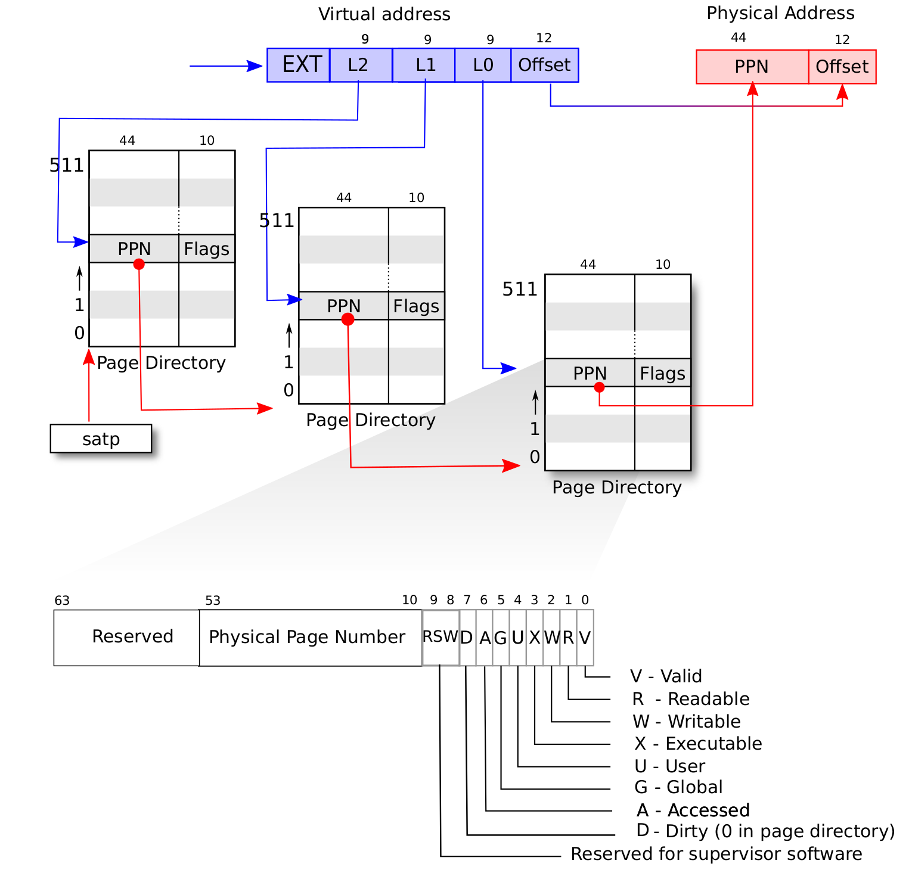

# Lab2 

## 编程作业

1. `sys_get_time` 实现思路
    + 实现 `sys_get_time`, 需考虑 `TimeVal` 跨页的问题, 其可参考 `sys_write` 中 `translated_byte_buffer` 的使用.
    + 在使用 `translated_byte_buffer` 时, 应熟悉其语义, 即 **将一个用户空间中连续的虚拟内存地址缓冲区, 转换为内核可以直接访问的一个或多个物理内存切片**. 
    + 首先获取当前时间 tv, 将 tv 转为字节数组 src, 将应用地址空间中的一段缓冲区 _ts 转化为在内核地址空间直接读写的字节切片向量 bufs, 将 src 分批次复制到 bufs 中.
2. `sys_trace` 实现思路
    + 实现 `sys_trace`, 最重要的是检查地址的权限. 对于用户态的应用, 应该检查相应 `PTE` 的 `U` 位是否为 `1`, 若为 0 则不应允许用户访问. 实现初期, 由于未考虑 `PTE_U`, 运行 `ch4_trace1.rs` 导致操作系统崩溃, 其他应用无运行的机会.
    + 实现 `sys_trace` 的统计系统调用功能, 可考虑在应用的 `TaskControlBlock` 这加入类型为 `BTreeMap<usize, usize>` 的 `syscall_counter`, 无需使用数组进行统计.
3. `sys_mmap` 实现思路
    + 实现 `sys_mmap` 时, 应先检查 start 地址是否页对齐, 还需要检查权限设置是否合法.
    + 在 `MemorySet` 中设置辅助函数 `map_pages`, 其接受虚拟起始地址 `sva` 和虚拟结束地址 `eva` 以及权限 `perm`, 实际创建相应的映射关系.
    + 在 `map_pages` 这, 首先检查 `[sva.floor, eva.ceil)` 中是否存在已经被映射的页, 即检查此与 `areas` 中任意 `vpn_range` 是否存在交叠. 检查交叠的函数 `SimpleRange<T>.overlap` 较为容易实现: `!(self.r <= other.l || other.r <= self.l)`.
    + 通过交叠检查后, 直接调用 `MemorySet.push` 即可.
    + 本次并未检查物理内存是否足够, 但也通过测试, 后面有时间再加入.
4. `sys_munmap` 实现思路
    + 参考相关测试用例发现, `sys_munmap` 回收的区域与之前调用 `sys_mmap` 的申请的区域一致, 或者之前未通过 `sys_mmap` 申请区域, 由此可直接按照比较 `[sva.floor, eva.ceil)` 与 `areas` 中 `vpn_range` 是否相等, 若存在相等的项, 则释放成功.
    + 此实现较为简单, 后续考虑更复杂的场景.

## 简答作业
1. sv39 页表项的组成, 以及其标志位的作用.
    + 
    + sv39 页表项 PTE 由 PPN 和各标志位组成.
        + V: 页表项是否有效
        + R: 页是否具有读取权限
        + W: 页是否具有写入权限
        + X: 页是否具有执行权限
        + U: 页是否在 U Mode 可被访问
        + A: 从页表项上的这一位被清零之后, 页表项的对应虚拟页面是否被访问过
        + D: 从页表项上的这一位被清零之后, 页表项的对应虚拟页面是否被修改过
2. 缺页
    + 哪些异常可能是缺页导致的？
        + Instruction Page Fault: 当 CPU 的取指单元尝试从一个虚拟地址获取下一条指令, 但该地址的页表项无效或不存在时发生;
        + Load Page Fault: 当执行 load 指令尝试从内存读取数据, 但目标虚拟地址的页表项无效或不存在时发生;
        + Store Page Fault: 当执行 store 指令尝试向内存写入数据, 但目标虚拟地址的页表项无效或不存在时发生; 
    + 发生缺页时的重要寄存器
        + `scause` 指明异常的原因
        + `stval` 保存导致异常的虚拟地址
    + Lazy 策略的好处
        + 提高内存利用率
        + 减少不必要的 I/O 操作
    + 申请 10G 连续的内存页面, sv39 页表占用多少内存?
        + 一个页 4 KB, 一个 PTE 8 Byte, 则一个页可存放 512 个 PTE.
        + 映射 10GB 连续的内存页需要的页数: 10GB / 4KB = 2.5 * 2^20 个页面, 其需要占用三级页表 2.5 * 2^20 * 8 Byte = 20 * 2^20 Byte = 20 MB
        + 每个二级页表可指向 512 个三级页表, 则需要二级页表项数目为: 2.5 * 2^20 / 512 = 5120, 二级页表占用的存储空间为 5120 * 8 Byte = 40 KB
        + 一级页表项的数目为: 5120 / 512 = 10, 即只需要一个一级页表 4KB
        + 故为映射 10G 的内存, 页表本身就需要占用大约 20MB 的物理内存. 
    + 如果采用 Lazy 策略, 可减少页表占用物理内存.
      + 当用户调用 mmap 申请 10G 内存时, 操作系统并不会立即分配物理页帧和建立完整的页表映射. 
      + 在进程的 MemorySet 中, 记录下这个虚拟地址区间 [start, start + 10G) 是合法的, 并记下其权限.
      + 当进程第一次访问这 10G 区域内的某个地址时, 会触发存储缺页或加载缺页异常.
    + Swap
      + 若页面被换出到磁盘, 页表项的有效位会被清除, 可以使用 PPN 和 Reversed 保存额外信息.
3. 双页表与单页表
    + 在单页表模型中, 更换页表只发生在进程上下文切换的时候.
    + 在 RISC-V 的页表项 PTE 中, 存在 U (User) 位, 当 U 位 = 0 时表示这个页面是内核页.
    + 开销小: 当用户进程通过系统调用或因中断进入内核时不需要更换页表.
    + 双页表: **用户态/内核态切换**和**进程上下文切换**时需要更换页表
