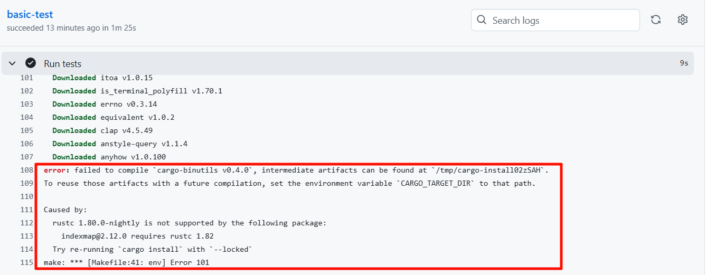
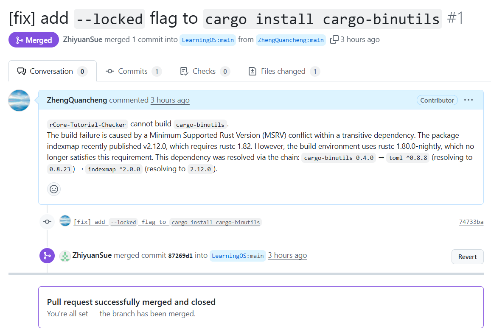

# Lab4

## 编程作业

- `sys_stat` 系统调用用于获取文件状态. 
    - 由于 EFS 只有根目录, 且需要获取此文件硬链接数量, 所以可在 `easy-fs/src/vfs.rs` 为 `Inode` 添加一个只能 `ROOT_INODE` 调用的方法 `link_count`, 其根据 `inode_id` 查找根目录下有多少文件链接于此. 
    - 在 `sys_fstat` 函数中, 从当前 Task 的 `fd_table` 读取相关文件, 为方便操作, 可为 `File` Trait 添加 state 接口, 用于获取文件的状态. 注意通过 `translated_byte_buffer` 将应用地址空间中的一段缓冲区 `_st` 转化为在内核地址空间直接读写的字节切片向量 `bufs`, 将 `stat` 分批次复制到 bufs 中.
- `sys_linkat` 系统调用用于创建一个文件的硬链接.
    - 由于 EFS 只有根目录, 可在 `easy-fs/src/vfs.rs` 为 `Inode` 添加一个只能 `ROOT_INODE` 调用的方法 `link` 执行实际的创建硬链接操作. 
    - 通过 `modify_disk_inode` 函数修改根目录节点; 调用 `increase_size` 方法增加空间, 再通过 `write_at` 写入目录项.
- `sys_unlinkat` 系统调用用于取消一个文件的链接.
    - 在 `easy-fs/src/vfs.rs` 为 `Inode` 添加一个只能 `ROOT_INODE` 调用的方法 `unlink` 执行实际的取消硬链接操作. 
    - 调用 `find` 方法, 根据文件名获取 `inode`, 若未找到则直接返回.
    - 定位到要删除的目录项, 并用最后一个目录项覆盖它.
    - 检查该 `inode` 的链接数, 若为 0 则删除该 `inode` 的数据块

## 问答作业

- `ROOT_INODE` 是整个文件系统的根目录, 所有文件访问都必须从 `ROOT_INODE` 开始. 
- 若 `ROOT_INODE` 损坏, 无法通过文件名访问对应的文件, 文件数据本身可能完好.

## 其他问题
+ 提交代码到 Github, 发现 Actions 无法构建 cargo-binutils.
    + 
+ 此构建失败是由一个传递性依赖的最低支持 Rust 版本冲突引起的. `cargo-binutils 0.4.0` → `toml ^0.8.8` (resolving to `0.8.23`) → `indexmap ^2.0.0 `(resolving to `2.12.0`). `indexmap 2.12.0` 的最低支持 Rust 版本为 `1.82`，而我们的环境为 `1.80.0-nightly`，不满足其要求. 使用 `cargo install cargo-binutils` 时加上 `--locked` 标志可强制 Cargo 遵循 `Cargo.lock` 文件的要求，使用 `indexmap 2.6.0`，从而解决此冲突.
    + [cargo-binutils](https://docs.rs/crate/cargo-binutils/0.4.0)
    + [Cargo.lock](https://docs.rs/crate/cargo-binutils/0.4.0/source/Cargo.lock)
+ 为修复此问题, 向 `rCore-Tutorial-Checker` 提交 PR.
    + [[fix] add --locked flag to cargo install cargo-binutils](https://github.com/LearningOS/rCore-Tutorial-Checker/pull/1)
    + 
